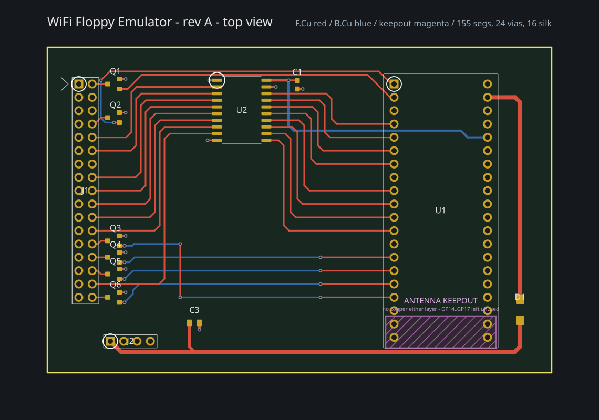

# webadf

An Amiga disk library that can put a disk in a real Amiga's floppy drive, over WiFi.

Two halves that only make sense together:

- **A web app** for keeping ADFs — upload them, identify them against TOSEC and
  OpenRetro, organise them into collections, browse *inside* a disk, and edit
  its files in the browser.
- **A drive replacement** — an RP2350 board that plugs into an Amiga's floppy
  connector, pretends to be a DD floppy drive, and streams whichever disk you
  picked in the web app over WiFi. No USB stick, no shuffling images by hand.

Click *Mount* in a browser; the Amiga reads a disk.



*Rev B, routed and not yet fabricated. Rev A2 is the board bring-up actually
runs on. Red is the front copper layer, blue the back; the magenta box is the
Pico's antenna keepout, which is why GP14–GP17 are left unused.*

---

## How it actually works

An Amiga floppy drive is not a block device. It hands Paula a raw magnetic flux
stream and the Amiga decodes MFM in software, so a drive emulator has to produce
**flux**, at the right rate, forever, while the disk spins.

```
  browser  ──mount──▶  web app  ──encodes ADF → MFM──▶  device  ──flux──▶  Amiga
                          │                               │
                     Postgres + blobs              RP2350 + 8 MB PSRAM
```

The server encodes a 901,120-byte ADF into 2,027,536 bytes of Amiga MFM and the
board streams it: PIO emits 2 µs bitcells, DMA restarts each revolution and
raises INDEX, giving exactly 300 rpm. The whole disk lives in PSRAM, so a seek is
answered immediately instead of over the network.

**The device streams flux rather than holding ADFs**, deliberately. ADF-on-device
would be 2.25× less to download and 2.4 MB less PSRAM — but an ADF cannot
represent a copy-protected disk and a flux container can, so HFE and IPF can ride
the same path later without touching the firmware.

## Status

Honest version, because a README that only lists what works is not useful.

| | |
|---|---|
| Web app — library, collections, ADF editing, identification | live |
| Upload `.adf`, `.adz`, `.dms`; drop `.lha`/`.zip` onto a disk | live |
| Device: provisioning portal, WiFi, TLS, pairing | verified on hardware |
| Mount a disk from the browser, eject it | verified on hardware |
| OLED status panel | verified on hardware |
| Reading a disk **from an actual Amiga** | **not yet — no floppy cable connected** |
| Writing (Amiga → disk image) | capture path built, unverified, WPROT still asserted |
| Disk history / rewind | storage model built, not wired up |

## Repository

| Path | What |
|---|---|
| `src/` | the Next.js app |
| `src/lib/adfmfm/` | ADF ⇄ Amiga MFM encoder, verified against Greaseweazle |
| `src/lib/adffs/` | AmigaDOS filesystem reader/writer (OFS/FFS) |
| `src/lib/archive/` | `.lha`, `.zip` and `.dms` decoders, all browser-side |
| `src/lib/disk-history/` | sector deltas and the version chain behind rewind |
| `wifi-floppy/firmware/` | the RP2350 firmware (pico-sdk ≥ 2.3.0) |
| `wifi-floppy/hardware/` | KiCad board, generated by `generate_pcb.py` |
| `HANDOFF.md` | the real engineering log: decisions, measurements, wrong turns |

`HANDOFF.md` is where the reasoning lives. It is long and candid on purpose —
including the mistakes, because those are the parts that cost the most to
rediscover.

## Running it

```bash
pnpm install
pnpm dev                  # needs .env.local: DATABASE_URL, BLOB_READ_WRITE_TOKEN,
                          # BETTER_AUTH_SECRET, BETTER_AUTH_URL
pnpm test                 # vitest, pure logic
pnpm e2e                  # playwright, against a real database
```

Firmware:

```bash
export PICO_SDK_PATH=/path/to/pico-sdk        # tag 2.3.0 or later
pnpm firmware:build
pnpm firmware:test                            # host tests, no board needed
```

The provisioning access point uses the password **`wififloppy`** by default.
Set `PORTAL_AP_PASSWORD` at build time to change it. It is compiled into the
image and this repository is public, so it is documented rather than treated as
a secret — what actually gates provisioning is the pairing code you paste from
the web app. The AP password only stops a passer-by idly joining the setup
network during the few seconds it is up.

Every push that touches the firmware is built by
[`.github/workflows/firmware.yml`](.github/workflows/firmware.yml), which runs
the host tests and publishes a `.uf2` with a `manifest.json` beside it —
version, commit, size and SHA-256. The manifest is the shape the planned in-app
firmware updater consumes.

## On verification

Most of this talks to hardware or to a format nobody wrote down properly, so
wherever possible each layer is checked against an *independent* implementation
rather than against its own fixtures:

| | checked against |
|---|---|
| `pnpm adfmfm:diff` | Greaseweazle's `amigados` codec |
| `pnpm adffs:verify` | `xdftool` |
| `pnpm lha:verify` | the real `lha` binary |
| `pnpm dms:verify` | xDMS, the implementation ours was ported from |

Agreeing with your own fixtures only proves they were built by the same
misunderstanding.

## Licence

Not yet chosen — see the issues. Until one is added, the usual default applies:
all rights reserved.
