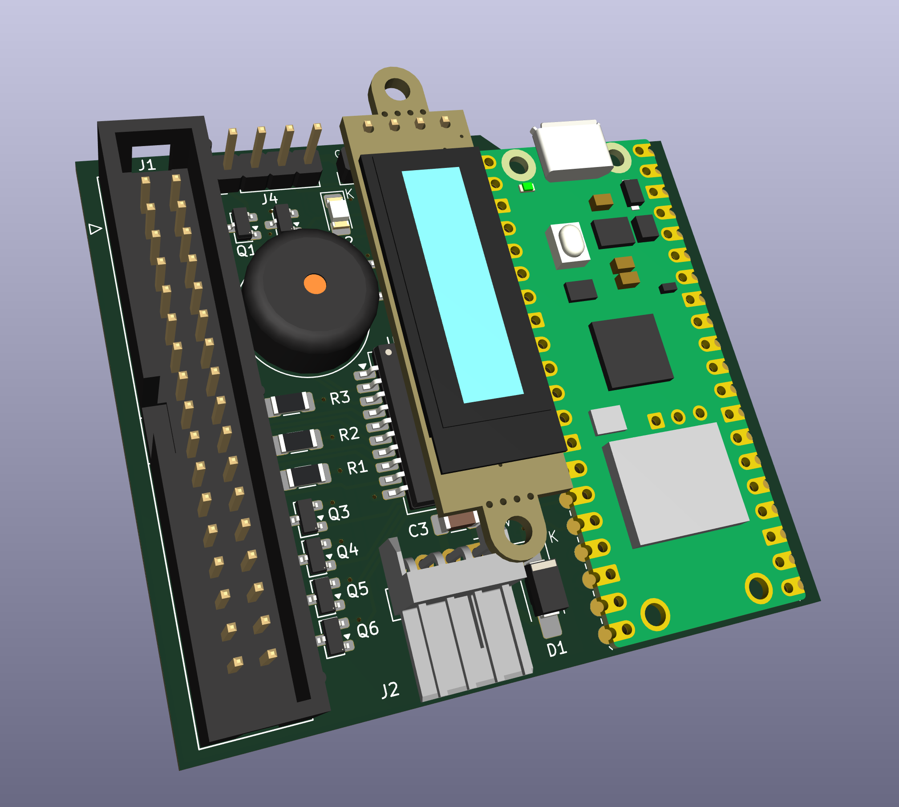

# webadf

An Amiga disk library that puts a disk in a real Amiga's floppy drive over WiFi.

Two halves that work together:

- **A web app** for keeping Amiga disk images. Upload them, have them identified
  against TOSEC, OpenRetro and Demozoo, organise them into collections, browse and
  edit the files inside a disk, and rewind a disk to any earlier version.
- **A drive replacement.** An RP2350 board plugs into the Amiga's floppy connector,
  behaves like a DD floppy drive, and plays whichever disk you pick in the web app.
  When the Amiga saves, the changes go back to the library.

Pick a disk in the browser, or tap its NFC tag on the drive, and the Amiga reads it.
Workbench 3.1 boots from the board, games load, and saves made on the Amiga show up
in the web app as new versions of the disk.



*Rev B, designed by Shanshe: 34-pin floppy header, floppy power connector, OLED
display, buzzer, a 4-pin header (J4), and a Pimoroni Pico Plus 2 W.
The KiCad project will be added to `wifi-floppy/hardware/`. The current bench board is
rev A2.*

## Features

### Library

- Upload `.adf`, `.adz`, `.dms` and `.hfe`; drop `.lha` and `.zip` archives onto a disk
  to pick files out of them.
- Each unique disk is stored once, however many times it is uploaded.
- Disks are identified against TOSEC, OpenRetro and Demozoo, and grouped into titles
  with cover art, screenshots, publisher, year and type.
- Collections, search as you type, and a layout that works on a phone.
- Create a blank formatted disk (OFS or FFS).
- Download any disk as an ADF.

### Inside a disk

- Browse the AmigaDOS filesystem in the browser: files, folders, free space.
- Add, rename, move and delete files and folders; drop a folder from your computer
  onto a disk; drag entries between folders.
- Every change is a new version. The history panel shows what changed in each
  version, lets you browse any old version, and restores one as a new version.
- HFE images (including long-track formats such as Turrican's) play read-only and can
  be extracted to an ADF when every sector decodes.

### The drive

- Set up from a phone: the board opens a WiFi setup page, you enter your network and
  a pairing code from the web app, and it joins your library.
- Mount and eject from the web app, from the drive chips in the header, or by
  tapping an NFC tag.
- Reads and writes on a real Amiga. Saves reach the library as new disk versions,
  including saves made while the board was offline.
- Works as DF0 or alongside a second drive as DF1.
- Write protection can be switched from the web app while the disk is in the drive.
- OLED status display: WiFi strength, what it is doing, the disk's name and the
  current track. An activity LED blinks on reads.
- Updates its own firmware from the web app. Releases are signed, a failed update
  falls back to the previous firmware, and the board never updates while a disk is
  in the drive.

### NFC tags

- Tap a tag on the drive to mount its disk. Tapping another tag swaps disks; tapping
  the one already in the drive does nothing.
- Write any disk to a tag from its library card or game page: click the NFC icon,
  tap a tag on the drive, and the result appears in the browser.
- A tag only ever mounts disks from your own library.
- Reader: HW-147C (Si512), on the board's I2C bus next to the OLED.

## How it works

An Amiga floppy drive does not deliver blocks. It hands Paula a raw magnetic flux
stream and the Amiga decodes MFM in software, so a drive emulator has to produce flux
at the right rate, continuously, while the disk spins.

```
  browser  ──mount──▶  web app  ──encodes ADF → MFM──▶  device  ──flux──▶  Amiga
     ▲                    │                                │
     └──── new version ◀──┴── Postgres + blobs     RP2350 + 8 MB PSRAM ◀── NFC tag
```

The server encodes a 901,120-byte ADF into 2,027,536 bytes of Amiga MFM and the board
streams it: PIO emits 2 µs bitcells, DMA restarts each revolution and raises INDEX,
giving 300 rpm. The whole disk lives in PSRAM, so a seek is answered immediately
instead of over the network. The board streams flux rather than ADFs, which lets
flux formats such as HFE use the same path.

When the Amiga writes, the board decodes the written tracks, uploads them, and the
server records them as a new version of the disk. Versions are stored as sector
deltas.

## Status

| | |
|---|---|
| Web app: library, collections, identification, search | live |
| Upload `.adf` `.adz` `.dms` `.hfe`; `.lha`/`.zip` onto a disk | live |
| File editing inside a disk, blank disks, drag and drop | live |
| Disk history: browse and restore any version | live, restore verified on hardware |
| Device: setup portal, WiFi, TLS, pairing | verified on hardware |
| Mount and eject from the browser and the drive chips | verified on hardware |
| Reading on a real Amiga (Workbench 3.1, games) | verified on hardware |
| Writing on a real Amiga, saves reach the library | verified on hardware |
| Second drive (DF1) alongside the board | verified on hardware |
| HFE, including long-track (Turrican) | verified on hardware; weak-bit titles not yet tested |
| Firmware updates from the web app | verified on hardware (current: 1.3.1) |
| NFC: tap to mount, write tags from the web | verified on hardware |
| Rev B board | in design (Shanshe) |

## Repository

| Path | What |
|---|---|
| `src/` | the Next.js app |
| `src/lib/adfmfm/` | ADF ⇄ Amiga MFM encoder, verified against Greaseweazle |
| `src/lib/adffs/` | AmigaDOS filesystem reader/writer (OFS/FFS) |
| `src/lib/archive/` | `.lha`, `.zip` and `.dms` decoders, all browser-side |
| `src/lib/hfe/` | HFE parsing, conversion for the board, ADF extraction |
| `src/lib/disk-history/` | sector deltas and the version chain behind history and restore |
| `src/lib/nfc/` | NFC tap and tag-writing rules and storage |
| `wifi-floppy/firmware/` | the RP2350 firmware (pico-sdk ≥ 2.3.0) |
| `wifi-floppy/hardware/` | the board (KiCad) |
| `docs/superpowers/specs/` | design specs, one per feature |
| `HANDOFF.md` | the engineering log: decisions, measurements, bench results |

## Running it

```bash
pnpm install
pnpm dev                  # needs .env.local: DATABASE_URL, BLOB_READ_WRITE_TOKEN,
                          # BETTER_AUTH_SECRET, BETTER_AUTH_URL
pnpm test                 # vitest, pure logic
pnpm e2e                  # playwright, against a real database
```

Firmware:

```bash
export PICO_SDK_PATH=/path/to/pico-sdk        # tag 2.3.0 or later
pnpm firmware:build
pnpm firmware:test                            # host tests, no board needed
pnpm firmware:publish --dry-run               # sign and register a release
```

Write a disk to an NFC tag from the command line:

```bash
pnpm nfc:write "Turrican II disk 1"           # then tap a tag on the drive
```

The setup access point uses the password **`wififloppy`** by default. Set
`PORTAL_AP_PASSWORD` at build time to change it. The pairing code from the web app is
what authorises a board to join a library.

Every push that touches the firmware is built by
[`.github/workflows/firmware.yml`](.github/workflows/firmware.yml), which runs the host
tests and publishes a `.uf2` with a `manifest.json` (version, commit, size, SHA-256).

## Verification

Each layer that talks to hardware or to an undocumented format is checked against an
independent implementation:

| | checked against |
|---|---|
| `pnpm adfmfm:diff` | Greaseweazle's `amigados` codec |
| `pnpm adffs:verify` | `xdftool` |
| `pnpm lha:verify` | the real `lha` binary |
| `pnpm dms:verify` | xDMS, the implementation ours was ported from |

## Licence

Not yet chosen. Until one is added, all rights reserved.
